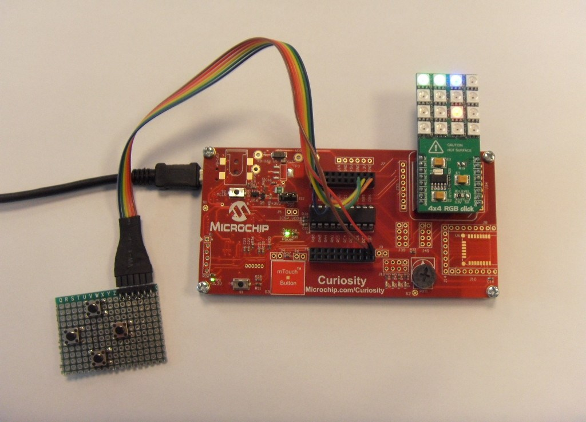
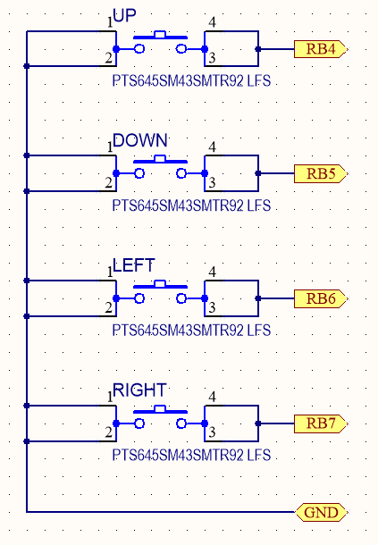
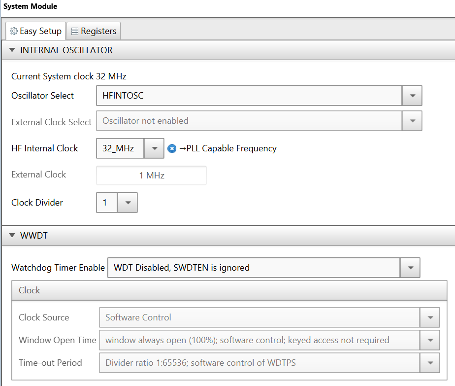
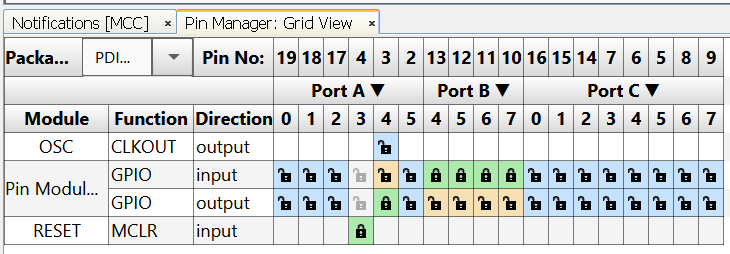
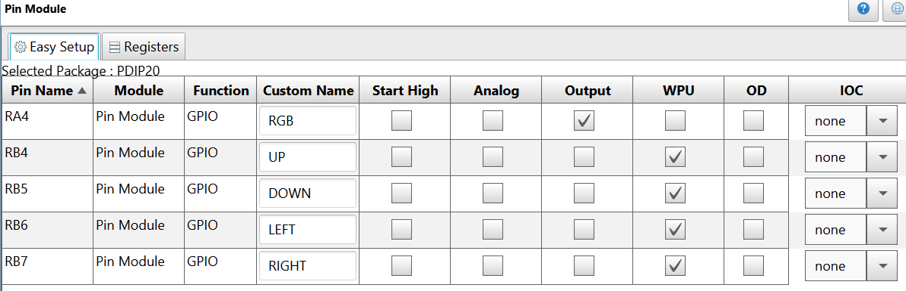

# Snake Game Using 4x4 RGB Click™

This is an example of a small snake game running on a PIC16F18446.

 

## Related Documentation
- [PIC16F18446 Product Family Page](https://www.microchip.com/design-centers/8-bit/pic-mcus/device-selection/pic16f18446)
- [PIC16F18446 datasheet](http://ww1.microchip.com/downloads/en/DeviceDoc/40001985B.pdf) for more information or specifications.

## Software Used
- MPLAB® X IDE 5.30 or newer [(microchip.com/mplab/mplab-x-ide)](http://www.microchip.com/mplab/mplab-x-ide)
- MPLAB® XC8 2.10 or newer compiler [(microchip.com/mplab/compilers)](http://www.microchip.com/mplab/compilers)
- MPLAB® Code Configurator (MCC) 3.95.0 or newer [(microchip.com/mplab/mplab-code-configurator)](https://www.microchip.com/mplab/mplab-code-configurator)
- MPLAB® Code Configurator (MCC) PIC10/PIC12/PIC16/PIC18 library v1.80 or newer [(microchip.com/mplab/mplab-code-configurator)](https://www.microchip.com/mplab/mplab-code-configurator)

## Hardware Used
- PIC16F18446 PDIP20 with Curiosity Development Board [(DM164137)](https://www.microchip.com/Developmenttools/ProductDetails/DM164137)
- MikroElektronika™ 4X4 RGB CLICK™ [MIKROE-1881](https://www.mikroe.com/4x4-rgb-click)
- A custom made board with 4 pushbuttons

## Setup

In this demo,

- PIC16F18446 (20-pin, PDIP) MCU is used to run the snake game.
- 4X4 RGB Click Board from MikroElektronika™ is used as a display.
- The Curiosity development board is used as it supports a mikroBUS slot for MikroElektronika™ click boards and has got on-board programmer and debugger.
- A custom made board with 4 pushbuttons is used as a controller.

Buttons are connected as follows:

 

### Demo Hardware Setup

- Plug the PIC16F18446 MCU into its socket on the Curiosity board
- Plug the 4X4 RGB Click into the mikroBUS slot of the Curiosity board
- Connect the buttons according to the schematic above

### MCC Settings

This section shows the settings used in the demo/example for various MCU modules configuration. These settings were done using the Microchip Code Configurator (MCC). Open MCC to look at the settings of the modules.

### System Module Settings

The MCU uses the high frequency internal oscillator (HFINTOSC), and the clock is set to 32 MHz. Watchdog Timer is not used in this demo, so it is disabled.

 

### Pin Manager Settings

The pins are configured as follows:

- Pin RA4 is the output for controlling the RBG Click.
- Pin RB4 is the input for the UP button.
- Pin RB5 is the input for the DOWN button.
- Pin RB6 is the input for the LEFT button.
- Pin RB7 is the input for the RIGHT button.

The button pins have pull-ups enabled, so they read '1' when the buttons are released, and '0' when the buttons are pressed. The common button pin is GND.

 
 

# Demo

1. After making the above hardware connections, connect the Curiosity board to PC using the USB cable.
2. Build demo firmware and load the generated hex file onto the PIC16F18446 MCU. When the demo firmware is loaded, the snake game will start.
3. Use the 4 buttons to control the snake.

## Conclusion

This example shows how easy it is to make a simple snake game with the PIC16F18446, 4x4 RGB Click™ and MCC.
